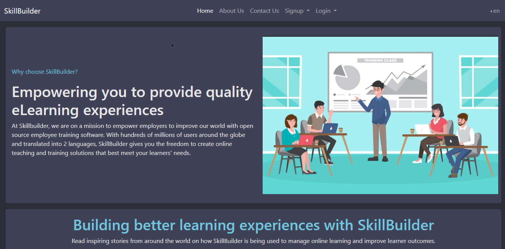
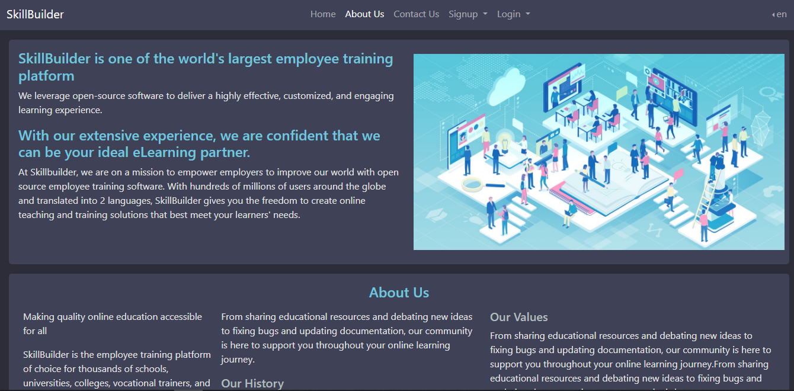
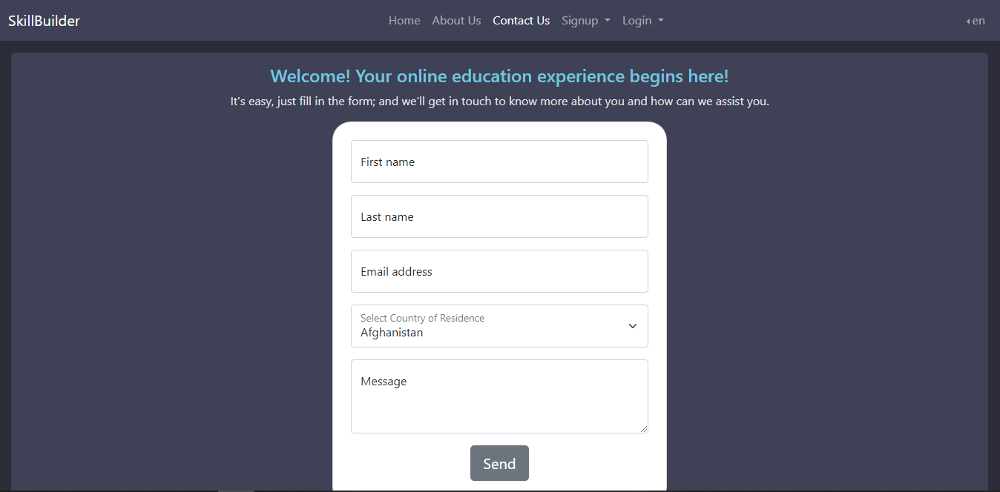
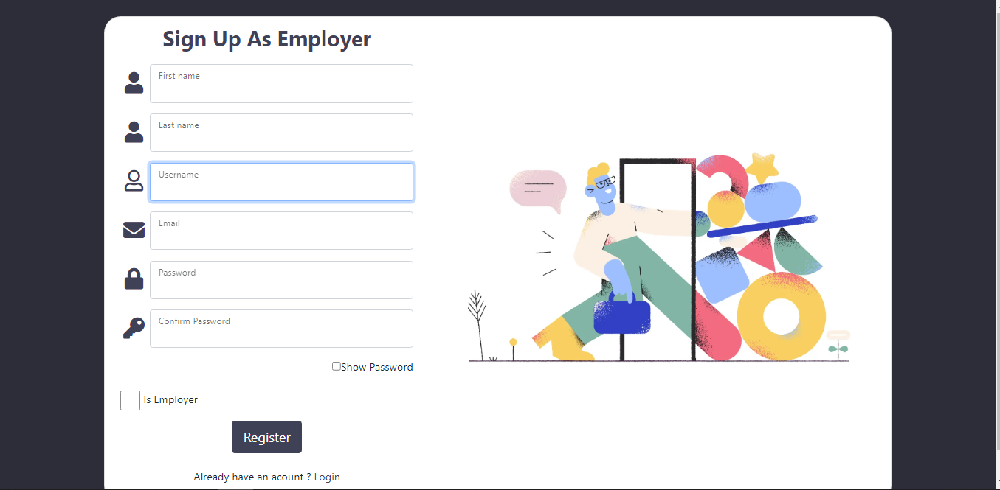
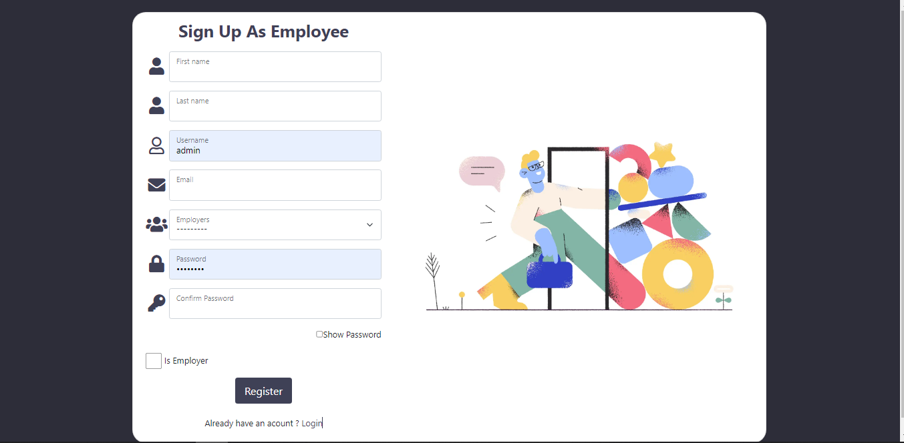
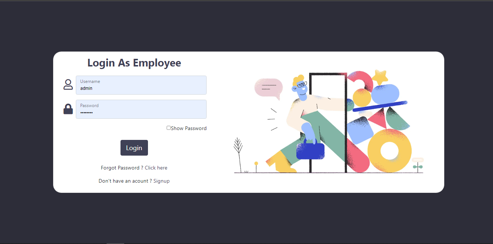
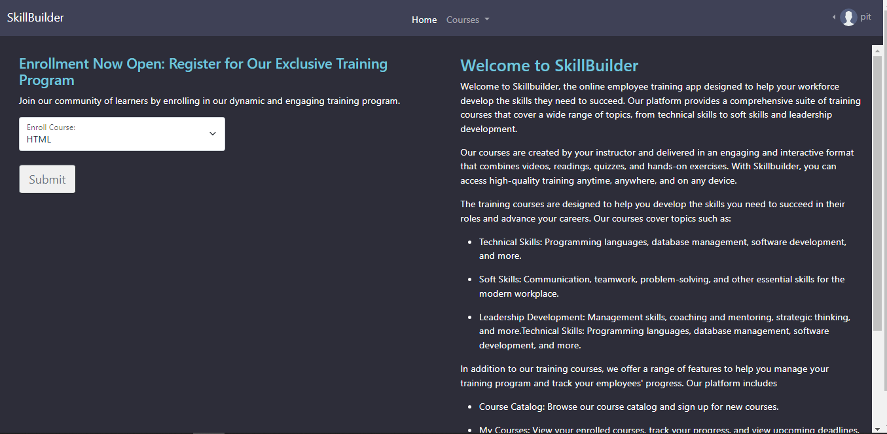
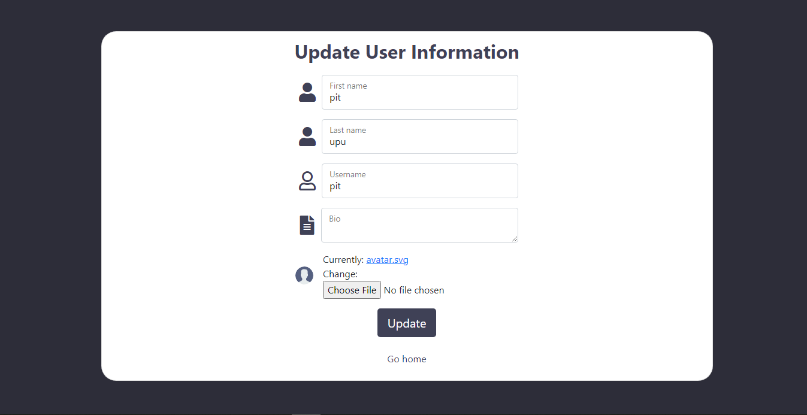
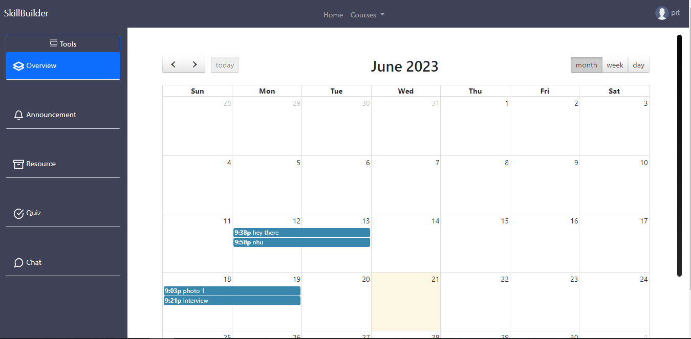
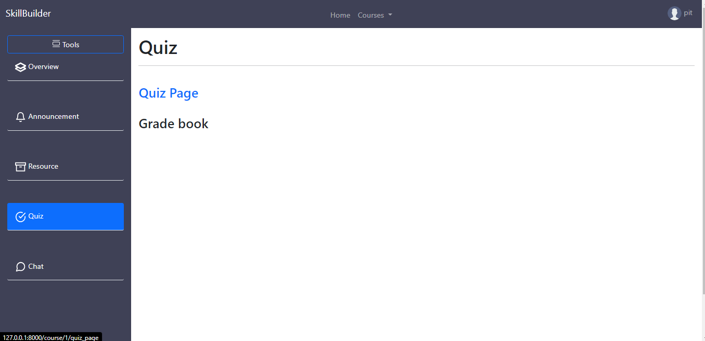

# SKILLBUILDER PROJECT

This is an employee training app to enable employers to perform CRUD and employees to read

## SkillBuilder Documentation
[SkillBuilder Documentation](<static/SkillBuilder Documentation.pdf>)

## Customer Requirements
### Your users should be able to:
1. Signup & log in with an email and password with account verification. There should be a
reset password feature to recover lost passwords password.
2. Employees Can download resources
3. Employees can view announcement
4. Real time chat app

### Admin
1. Perform CRUD on Course, Announcement, Resource, Room and Quiz 

## Installation

To install the project, you need to have Python 3 and pip installed on your system. Then, follow these steps:

- Clone this repository: 
[SkillBuilder](https://github.com/Kjeff24/SkillBuilder.git)
- Create a virtual environment: 
```
python -m venv venv
```
- Activate the virtual environment: 
```
`source venv/bin/activate` (on Linux/Mac) or `venv\Scripts\activate` (on Windows)
```
- Install the required dependencies: 
```
pip install -r requirements.txt
```

## Usage

- To run the project, you can set your email and password to handle email being sent. You can use a `.env` file to store them or change them from `settings.py`. For example:

```
EMAIL_FROM_USER = 'your email'
EMAIL_HOST_USER = 'your email'
EMAIL_HOST_PASSWORD = 'your email password'
```

- Train the chatbot Directory:chatbot
Run
```
python train.py
```

- Then, you can run the following commands:
``` 
python manage.py runserver
```

By default the development server will start at [http://127.0.0.1:8000/](http://127.0.0.1:8000/)


## Models
The project contains the following models:
| Models| Fields| Functions|
| ----- | ------| ---------|
| User | `is_employer, is_employee, is_email_verified, my_employer, first_name, last_name, bio, avatar` |
| Course |`name, description, instructor, created, updated`|
|Participants|`user, course`|
|Enrollment|` course, date_enrolled, members `|
|Resource|` name, course, description, youtubeLink, file, created, updated `|
|Announcement|` title, content, course, date, created, updated `|
|Room|` room_topic, course, room_description, created, updated `|
|Message|` user, room, body, updated, created `|
|Quiz|` name, course, number_of_questions, time, required_score_to_pass, difficluty `|`get_questions()`|
|Question|` text, quiz, created `|`get_answers()` |
|Answer|` text, correct, question, created `|
|Result|`quiz, user, score, completion_time, created, started  `|

## Views

| View| Functions|
| ----- | ---------|
|myapp/views - authentication.py|- loginPage <br>- logoutUser<br>- employeeSignupPage<br>- employerSignupPage<br>- send_activation_email<br>- activate_user|
|myapp/views - front_page.py|- home<br>- about<br>- contact |
|myapp/views - user_management.py |- updateUser |
|myapp/views - users_page.py |- employeeHome |
|course/views - announcement_page.py|- announcementPage |
|course/views - chat_room.py |- chatRoom  |
|course/views - profile_page.py|- profile|
|course/views - quiz_page.py |- quizPage  |
|course/views - resource_page.py |- resourcePage |
|quiz/views |- quiz_list_view<br>- quiz_view<br>- quiz_data_view<br>- save_quiz_view |

## Endpoints

The project provides the following endpoints:

- ` `: front page home
- `admin/`: Django admin (would be excluded during production)
- `employer_admin/`: Custom django admin for each employer
- `about/`: front page about
- `contact/`: front page contact
- `login/`: login page
- `logout/`: logout user
- `employeer_signup/`: employer signup
- `employee_signup/`: employee signup
- `employee_home/<str:pk>/`: employee home
- `update_user/<str:pk>/`: update user
- `activate-user/<uidb64>/<token>`: account activation
- `reset_password/`: password reset
- `reset_password_sent/`: password reset sent
- `reset/<uidb64>/<token>/`: password reset form
- `reset_password_complete/`: password reset done
- `course/<str:pk>/`: course page
- `course/<str:pk>/resource`: resource page
- `course/<str:pk>/announcement`: announcement page
- `course/<str:pk>/chat_room`: chat room page
- `course/<str:pk>/quiz_page`: quiz page
- `course/<str:pk2>/chat_room/<str:pk>/`: individual chat room page 
- `profile/<str:pk>/`: user profile page 
- `course/<str:pk2>/quiz/`: view all quizzes of a course
- `course/<str:pk2>/quiz/<pk>/`: Real quiz and answers page
- `course/<str:pk2>/quiz/<pk>/save/`: save quiz
- `course/<str:pk2>/quiz/<pk>/data/`: view quiz solutions with their correct answers
- `re_path(r'^.*/$', custom_404)`: a view for unavailable pages


## Preview

### UML Diagram of models


### Front Page


### About


### Contact


### Signup as Employer


### Signup as Employee


### Employer Login


### Employee Login


### Employer Home


### Employee Home


### Employee Update Information


### Overview


### Announcement


### Resources


### Room


### Quiz Page


### Quiz List Page


### Quiz Modal Page


### Quiz Start Page


